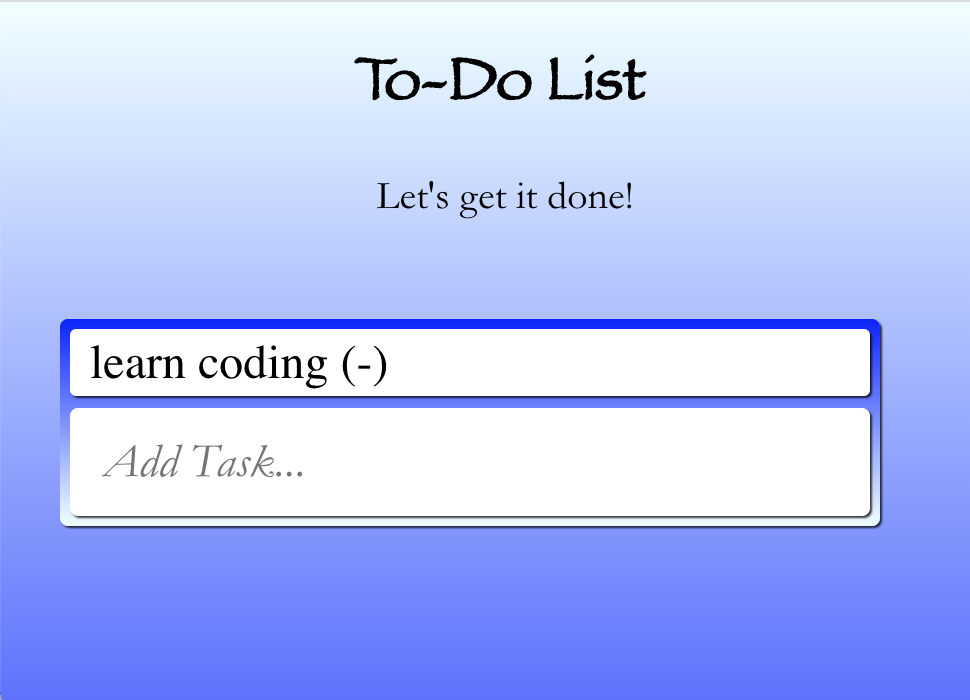

# Title: To-Do List

_Created by Maegan Stayrook_

Description:
A simple exercise created through MERN course where Maegan had to create and style a to-do list.

How to Run:
PLEASE NOTE: This application uses React, so you will need to use "npm install" in the folder to initialize.
1. Click on "Add Task" box
2. Type in your task/to do item
3. Hit enter
4. Remove item(s) by clicking on them in the list above the text field

Roadmap:
Maegan has always wanted to make a task manager app that caters specifically to her needs, and this assignment has given her the beginning of this goal. She plans to expand upon this assignment and set it up to meet her requirements as time passes. Here are some of the things she plans to do:
- Center the To-Do List with the page
- Make it so the list won't disappear if closing the page, but retains data only for specific people (might require login and individual account data)
- Add calendar function
- Add priority options
- Add deadline options

License: MIT License

<!---
Typical things inside a README file:
- Name: The name of the project. This name should be a descriptive, specific name for your project and what it does.  
- Description: A description of the project to let people know what the project is for. A list of features could also be added here as a sub-section. 
- Installation: If needed, you could include steps to help people get started with your project.
- Usage: You can include examples of how to use your project in this section and highlight the expected outcomes. 
- Support: You can tell people where to go for help regarding your project (example: email, Twitter, etc.). 
- Roadmap: This section could include any future fixes or improvements you might be planning for your project. 
- License information: For open source projects, you can describe how they’re licensed.  
--->

